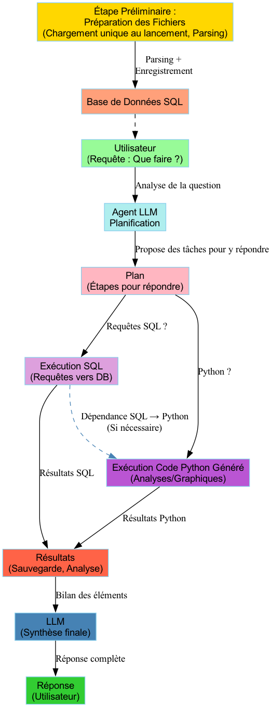

# Projet de Data Interpreter IA

Ce projet est une application REST qui permet de traiter divers types de fichiers (à savoir .xls, .xlsx, .csv, .json, .pdf, .py) et de générer des analyses sur ces fichiers en utilisant un modèle de langage large (LLM). Il intègre des fonctionnalités d'extraction de texte, d'images, de données relationnelles et de code Python. Il utilise l'écosystème LangChain, des bases de données DuckDB, ainsi que FastAPI pour l'interface utilisateur.

## Table des matières

- [Quick Start](#quick-start)
- [Architecture du système](#architecture-du-système)
- [Prérequis](#prérequis)
- [Installation du Projet](#installation-du-projet)
- [Lancer l'Application](#lancer-lapplication)
- [Utilisation de l'API REST](#utilisation-de-lapi-rest)
- [Fonctionnalités Clés](#fonctionnalités-clés)
- [Organisation des Fichiers](#organisation-des-fichiers)
- [Exemples de Fichiers Supportés](#exemples-de-fichiers-supportés)
- [Exemples d'usage avancés](#exemples-dusage-avancés)
- [Configuration de l'environnement](#configuration-de-lenvironnement)
- [Lancement Interface OpenWebui](#lancement-interface-openwebui)
- [FAQ](#faq)
- [Avertissement](#avertissement)

## Quick Start

### Démarrage rapide en 5 minutes

1. **Clonez et installez les dépendances :**
   ```bash
   git clone <URL_DU_PROJET>
   cd <nom_du_répertoire>
   pip install -r requirements.txt
   ```

2. **Installez Ollama et les modèles :**
   ```bash
   # Installation Ollama
   curl -o- https://ollama.com/download.sh | bash
   
   # Démarrage du service
   ollama serve
   
   # Téléchargement des modèles (dans un autre terminal)
   ollama pull duckdb-nsql:latest
   ollama pull mistral-small3.1:latest
   ```

3. **Lancez l'application :**
   ```bash
   # Mode Terminal
   sh run_terminal.sh ./data
   
   # OU Mode OpenWebUI
   sh run_pipelines.sh
   ```

4. **Testez avec un fichier :**
   ```bash
   curl -X POST "http://localhost:8000/query/" \
        -H "Content-Type: application/json" \
        -d '{"complex_query": "Analyse les données et donne-moi un résumé"}'
   ```

## Architecture du système

### Vue d'ensemble de l'architecture

```
┌─────────────────┐    ┌──────────────────┐    ┌─────────────────┐
│   Interface     │    │   Data           │    │   LLM Models    │
│   - OpenWebUI   │◄──►│   Interpreter    │◄──►│   - Ollama      │
│   - REST API    │    │   Core           │    │   - Mistral     │
│   - Terminal    │    │                  │    │   - DuckDB-NSQL │
└─────────────────┘    └──────────────────┘    └─────────────────┘
                                │
                                ▼
┌─────────────────┐    ┌──────────────────┐    ┌─────────────────┐
│   File          │    │   Processing     │    │   Database      │
│   Processing    │    │   Pipeline       │    │   - DuckDB      │
│   - PDF/OCR     │◄──►│   - SQL Gen      │◄──►│   - SQLite      │
│   - Excel/CSV   │    │   - Python Gen   │    │   - History     │
│   - JSON/Python │    │   - Analysis     │    │                 │
└─────────────────┘    └──────────────────┘    └─────────────────┘
```

### Flux de traitement des données

1. **Ingestion** : Upload et détection automatique du type de fichier
2. **Extraction** : Parsing spécialisé selon le format (PDF→OCR, Excel→Tables, etc.)
3. **Stockage** : Chargement dans DuckDB avec schéma optimisé
4. **Planification** : Génération d'un plan d'analyse par le LLM
5. **Exécution** : Génération et exécution de requêtes SQL/Python
6. **Synthèse** : Analyse des résultats et génération de la réponse finale

### Présentation de l'algorithme du Data Interpreter sous forme de schéma



## Prérequis

- Python 3.11 ou plus récent
- `tesseract` pour l'extraction OCR
- Librairies Python listées dans `requirements.txt`
- `ollama` pour utiliser les LLM

### Installation de Tesseract

Ubuntu/Debian :
```bash
sudo apt install tesseract-ocr
```

macOS :
```bash
brew install tesseract
```

### Installation de Ollama

Pour utiliser les modèles LLM avec Ollama, suivez les instructions ci-dessous :

1. Installez Ollama :

    macOS :
    ```bash
    brew install ollama
    ```

    Linux :
    ```bash
    curl -o- https://ollama.com/download.sh | bash
    ```

2. Lancez le service Ollama :

    ```bash
    ollama serve
    ```

3. Téléchargez les modèles LLM requis :

    ```bash
    ollama pull duckdb-nsql:latest
    ollama pull llama3.2:latest
    ollama pull mistral-small3.1:latest
    ```

## Installation du Projet

1. Clonez le répertoire du projet :

    ```bash
    git clone <URL_DU_PROJET>
    cd <nom_du_répertoire>
    ```

2. Installez les dépendances nécessaires à l'aide de `requirements.txt` :

    ```bash
    pip install -r requirements.txt
    ```

## Lancer l'Application

Pour exécuter l'application, lancez la commande suivante :

```bash
sh run_terminal.sh <chemin_vers_vos_fichiers>
```

- Remplacez `<chemin_vers_vos_fichiers>` par le chemin des fichiers que vous souhaitez traiter.

L'application se lancera sur `http://0.0.0.0:8000`.

## Pour obtenir des indications de lancement dans le terminal


```bash
sh run_terminal.sh --help
```

## Utilisation de l'API REST

L'API REST est développée avec FastAPI. Voici un exemple d'utilisation :

- Endpoint : `/query/`
- Méthode : `POST`
- Corps de la requête :
  ```json
  {
    "complex_query": "<votre_question>"
  }
  ```
- Réponse :
  ```json
  {
    "analysis_result": "<résultat_de_l'analyse>"
  }
  ```

Vous pouvez tester l'API à l'aide d'un outil comme `Postman` ou `curl`.

### Exemple d'Exécution via Curl

```bash
curl -X POST "http://localhost:8000/query/" -H "Content-Type: application/json" -d '{"complex_query": "Donne-moi les statistiques de ventes"}'
```

## Fonctionnalités Clés

1. **Extraction de Texte et Images des PDF :** Le projet utilise `pdfminer.six` pour extraire le texte et `PyMuPDF` pour extraire les images des fichiers PDF.
2. **Extraction de Texte par OCR :** `pytesseract` est utilisé pour extraire le texte des images présentes dans les PDF.
3. **Analyse de Code Python :** Extraction des fonctions, classes, imports et autres éléments d'un fichier `.py` en utilisant le module `ast`.
4. **Chargement de Données dans une Base DuckDB :** Les fichiers CSV, Excel, JSON, et PDF peuvent être chargés dans DuckDB.
5. **Génération Automatique de Réponses et d'Outils :** Utilisation de modèles LLM (à partir de LangChain) pour générer des plans d'action, des requêtes SQL et des analyses complètes.

## Organisation des Fichiers

- `main.py` : Le script principal pour exécuter l'application.
- `requirements.txt` : Liste des dépendances à installer.
- `README.md` : Ce fichier de documentation.
- `CHANGELOG.md` : Ce fichier récapitulatif des différentes versions du projet.
- `src/`: Ce dossier contient les fichiers sources du projet. 
- `pipelines/`: Ce dossier contient le script python de la sous solution sous forme de pipeline OpenWebui.
- `.env`: Ce fichier contient les variables d'environnement essentielles pour une bonne exécution.
- `docker-compose.yml`: Ce script Docker va permettre de mettre en place l'interface OpenWEBUI ainsi que son serveur Pipeline
- `run_pipelines.sh`: Ce script sh va permettre de lancer l'interface OpenWEBUI.
- `run_terminal.sh`: Ce script va permettre de lancer le data interpreter en mode terminal.
- `version.py`: Ce fichier python référence la version actuelle de la solution déployée.

## Exemples de Fichiers Supportés

- **Excel (.xls, .xlsx, xlsm)** : Chargement de toutes les feuilles disponibles dans une base de données.
- **CSV (.csv)** : Chargement dans une table DuckDB avec traitement préalable.
- **JSON (.json)** : Normalisation des données imbriquées et chargement.
- **PDF (.pdf)** : Extraction de texte et images avec OCR.
- **Python (.py)** : Analyse et extraction du code, des fonctions, classes, et autres éléments Python.

## Exemples d'usage avancés

### 1. Analyse de données de ventes (Excel/CSV)

**Fichier :** `ventes_2024.xlsx`
```json
{
  "complex_query": "Analyse les tendances de ventes par mois et identifie les produits les plus performants. Crée un graphique des ventes mensuelles."
}
```

**Résultat attendu :**
- Analyse statistique des ventes
- Identification des top produits
- Génération d'un graphique matplotlib
- Recommandations basées sur les tendances

### 2. Extraction et analyse de documents PDF

**Fichier :** `rapport_financier.pdf`
```json
{
  "complex_query": "Extrait tous les tableaux financiers du PDF et calcule les ratios de rentabilité. Compare avec les années précédentes si disponible."
}
```

**Capacités :**
- OCR automatique des tableaux
- Extraction de données numériques
- Calculs financiers automatisés
- Analyse comparative

### 3. Analyse de code Python

**Fichier :** `mon_projet.py`
```json
{
  "complex_query": "Analyse la complexité du code, identifie les fonctions non utilisées et suggère des améliorations de performance."
}
```

**Fonctionnalités :**
- Analyse AST (Abstract Syntax Tree)
- Détection de code mort
- Métriques de complexité
- Suggestions d'optimisation

### 4. Traitement de données JSON complexes

**Fichier :** `api_logs.json`
```json
{
  "complex_query": "Analyse les logs d'API, identifie les endpoints les plus utilisés et détecte les anomalies de performance."
}
```

**Traitement :**
- Normalisation de JSON imbriqué
- Analyse temporelle
- Détection d'anomalies
- Visualisation des patterns

### 5. Analyse multi-fichiers avec corrélations

**Fichiers :** `ventes.csv`, `marketing.xlsx`, `feedback.json`
```json
{
  "complex_query": "Corrèle les données de ventes avec les campagnes marketing et le feedback client. Identifie quelles campagnes ont le meilleur ROI."
}
```

**Analyse croisée :**
- Jointures automatiques entre sources
- Calculs de corrélation
- Analyse de ROI
- Recommandations stratégiques

### 6. Utilisation des flags avancés

**Forcer une nouvelle analyse :**
```json
{
  "complex_query": "Refais l'analyse des ventes avec les nouveaux paramètres #force"
}
```

**Mode consultation rapide :**
```json
{
  "complex_query": "Explique-moi ce qu'est un ratio de liquidité #pass"
}
```

### 7. Génération de rapports automatisés

**Requête complexe :**
```json
{
  "complex_query": "Génère un rapport exécutif complet incluant : 1) Résumé des KPIs, 2) Analyse des tendances, 3) Graphiques de performance, 4) Recommandations actionables. Sauvegarde le tout en PDF."
}
```

**Sortie :**
- Rapport PDF structuré
- Graphiques intégrés
- Tableaux de données
- Recommandations personnalisées

### 8. Analyse prédictive

**Données historiques :**
```json
{
  "complex_query": "Utilise les données des 3 dernières années pour prédire les ventes du prochain trimestre. Inclus un intervalle de confiance."
}
```

**Modélisation :**
- Régression temporelle
- Analyse de saisonnalité
- Prédictions avec intervalles
- Validation croisée

## Exemple de commandes additionnelles

- `sh run_terminal.sh --help` : Permet d'obtenir le helper du programme
- `sh run_terminal.sh --v` : Permet d'obtenir le numéro de version du programme actuel

## Flags à inclure si besoin dans les requêtes

- `#force` : Permet de forcer le traitement d'une question meme si elle a été traitée précédemment.
- `#pass` : Permet de ne pas utiliser le processus de traitement et de questionner simplement le LLM.

### Exemple de requête avec le flag #force

```
{
  "complex_query": "Quel est le nom de la première colonne ? #force"
}
```

### Exemple de requête avec le flag #pass

```
{
  "complex_query": "Quel est le nom de la première colonne ? #pass"
}
```

## Configuration de l'environnement

À la racine du projet, vous allez pouvoir retrouver un fichier `.env` qui vous permettra de configurer les différents paramètres du projet. Ce fichier contient toutes les variables d'environnement nécessaires au bon fonctionnement de l'application en mode Terminal et en mode Pipeline (OpenWebUI).

### Variables de configuration principales

#### Configuration du serveur (Mode Terminal)
- `PORT` : Port d'écoute du serveur (par défaut : 8000)
- `ADDRESS` : Adresse IP d'écoute (par défaut : 0.0.0.0)

#### Modèles LLM
- `DATABASE_MODEL` : Modèle utilisé pour les requêtes de base de données (ex: duckdb-nsql:latest)
- `REASONING_MODEL` : Modèle utilisé pour le raisonnement et l'analyse (ex: mistral-small3.1:latest)
- `PLAN_MODEL` : Modèle utilisé pour la planification des tâches (ex: mistral-small3.1:latest)
- `CODE_MODEL` : Modèle utilisé pour la génération de code (ex: mistral-small3.1:latest)

#### Base de données
- `DB_FILE` : Chemin vers la base de données DuckDB principale
  - Mode Pipeline : `/srv/data/id/my_database.duckdb`
  - Mode Terminal : `./db/my_database.duckdb`
- `HISTORY_DB_FILE` : Chemin vers la base de données d'historique des conversations
  - Mode Pipeline : `/srv/data/id/chat_history.duckdb`
  - Mode Terminal : `./db/chat_history.duckdb`

#### Agent Python
- `SAVE_DIRECTORY` : Répertoire de sauvegarde des fichiers générés
  - Mode Pipeline : `/srv/`
  - Mode Terminal : `./output`

#### Configuration des logs
Chaque module possède ses propres paramètres de logging :

**Fichier principal (main.py)**
- `LOG_FILE_main` : Chemin du fichier de log
- `LOG_LEVEL_main` : Niveau de log (DEBUG, INFO, WARNING, ERROR)

**Autres modules** (history_func, LlmGeneration, PdfExtension, PythonExtension, PythonTool, SetupDatabase, SqlTool)
- `LOG_FILE_[module]` : Chemin du fichier de log pour chaque module
- `LOG_LEVEL_[module]` : Niveau de log pour chaque module

#### Configuration Ollama
- `OLLAMA_URL` : URL de l'API Ollama pour les embeddings
  - Mode Pipeline : `http://host.docker.internal:11434/api/embeddings`
  - Mode Terminal : `http://localhost:11434/api/embeddings`

#### Configuration Pipeline (OpenWebUI)
- `DATA_DIRECTORY` : Répertoire des données pour le mode Pipeline
- `OPENWEBUI_API_KEY` : Clé API pour OpenWebUI
- `OPENWEBUI_API` : URL de l'API OpenWebUI
- `DOWNLOAD_URL` : URL de téléchargement des fichiers

### Modes de fonctionnement

Le fichier `.env` est configuré pour supporter deux modes :
- **Mode Terminal** : Utilise des chemins locaux relatifs (commentés par défaut)
- **Mode Pipeline** : Utilise des chemins Docker pour l'intégration OpenWebUI (actifs par défaut)

Pour basculer entre les modes, commentez/décommentez les lignes appropriées dans le fichier `.env`.

Ces paramètres peuvent être modifiés selon vos besoins et votre environnement de déploiement.

## Lancement Interface OpenWebui

Pour lancer l'interface OpenWebui, exécutez la commande suivante :

```bash
sh run_pipelines.sh
```

## Les commandes utiles à lancer dans le mode terminal

- Afin d'avoir une documentation détaillée, vous pouvez faire cette commande help au démarrage.
```bash
sh run_terminal.sh --help
```

- Afin de connaitre la version actuelle de la solution : 
```bash
sh run_terminal.sh --v
```

## FAQ

### Questions fréquentes

#### 🚀 **Installation et Configuration**

**Q: Quels sont les prérequis système minimum ?**
R: Python 3.11+, 8GB RAM recommandés, 10GB d'espace disque libre pour les modèles Ollama.

**Q: Pourquoi Ollama ne se connecte pas ?**
R: Vérifiez que le service Ollama est démarré (`ollama serve`) et que les modèles sont téléchargés. En mode Docker, utilisez `host.docker.internal:11434`.

**Q: Comment changer les modèles LLM utilisés ?**
R: Modifiez les variables dans le fichier `.env` : `DATABASE_MODEL`, `REASONING_MODEL`, `PLAN_MODEL`, `CODE_MODEL`.

#### 📁 **Gestion des fichiers**

**Q: Quels formats de fichiers sont supportés ?**
R: Excel (.xls, .xlsx, .xlsm), CSV, JSON, PDF, Python (.py). Voir la section [Exemples de Fichiers Supportés](#exemples-de-fichiers-supportés).

**Q: Quelle est la taille maximum des fichiers ?**
R: Pas de limite stricte, mais les performances peuvent être affectées au-delà de 100MB. Pour les gros fichiers, utilisez le mode streaming.

**Q: Comment traiter plusieurs fichiers simultanément ?**
R: Placez tous les fichiers dans le même dossier et lancez l'application. Le système détectera automatiquement les relations entre fichiers.

#### 🔧 **Utilisation et API**

**Q: Comment utiliser les flags #force et #pass ?**
R: 
- `#force` : Force une nouvelle analyse même si la question a déjà été traitée
- `#pass` : Interroge directement le LLM sans traitement des données

**Q: L'API REST ne répond pas, que faire ?**
R: Vérifiez les logs dans `./Logs/` ou `/app/Logs/` selon le mode. Assurez-vous que le port 8000 n'est pas utilisé.

**Q: Comment accéder à l'interface OpenWebUI ?**
R: Après `sh run_pipelines.sh`, accédez à `http://localhost:3001`. L'interface peut prendre quelques minutes à démarrer.

#### 🐛 **Résolution de problèmes**

**Q: Erreur "Extension sqlite_scanner not found" ?**
R: Cette erreur a été corrigée dans les versions récentes. Assurez-vous d'utiliser la dernière version du code.

**Q: Les graphiques ne s'affichent pas ?**
R: Vérifiez que matplotlib est installé (`pip install matplotlib`) et que le répertoire de sortie est accessible.

**Q: Erreur de mémoire lors du traitement ?**
R: Réduisez la taille des fichiers ou augmentez la RAM disponible. Utilisez le mode streaming pour les gros datasets.

#### 🔒 **Sécurité et Performance**

**Q: Les données sont-elles sécurisées ?**
R: Les données restent locales. En mode Pipeline, elles sont isolées par chat_id. Évitez de traiter des données sensibles en production.

**Q: Comment améliorer les performances ?**
R: 
- Utilisez un SSD pour les bases de données
- Augmentez la RAM disponible
- Utilisez des modèles LLM plus petits si nécessaire
- Activez le cache des conversations

**Q: Puis-je utiliser d'autres modèles LLM ?**
R: Oui, tout modèle compatible Ollama peut être utilisé. Modifiez les variables d'environnement correspondantes.

#### 🔄 **Modes de fonctionnement**

**Q: Quelle est la différence entre mode Terminal et Pipeline ?**
R: 
- **Terminal** : Interface en ligne de commande, fichiers locaux
- **Pipeline** : Interface web OpenWebUI, environnement Docker

**Q: Comment basculer entre les modes ?**
R: Modifiez les commentaires dans le fichier `.env` pour activer/désactiver les configurations appropriées.

**Q: Puis-je utiliser les deux modes simultanément ?**
R: Non recommandé, car ils utilisent des chemins de base de données différents. Choisissez un mode principal.

#### 📊 **Analyse de données**

**Q: Comment interpréter les résultats d'analyse ?**
R: Le système génère des explications en langage naturel. Pour plus de détails, demandez des clarifications avec des questions de suivi.

**Q: Les prédictions sont-elles fiables ?**
R: Les prédictions sont basées sur les données historiques et des modèles statistiques. Toujours valider avec votre expertise métier.

**Q: Comment sauvegarder les analyses ?**
R: Les résultats sont automatiquement sauvegardés dans le répertoire configuré (`SAVE_DIRECTORY`). L'historique est conservé dans la base de données.

## Avertissement

Ce projet est en cours de développement et peut contenir des bugs. Utilisez-le à vos risques et périls. Les résultats générés par le LLM peuvent ne pas être exacts ou appropriés pour toutes les situations. Veuillez toujours vérifier les résultats avant de les utiliser dans un contexte critique.
